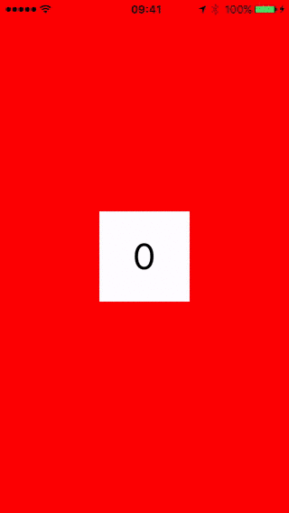

# TweeningUIPageViewController
[](http://cocoapods.org/?q=TweeningUIPageViewController) [](https://github.com/adamszeremeta/TweeningUIPageViewController/blob/master/LICENSE)

Extended UIPageViewController with background color tweening



Table of contents
=================

* [Features](#features)
* [Installation](#installation)
* [Usage](#usage)
* [License](#license)

Features
========

- animated background color tweening between controllers

Installation
============

The prefered way is to use [CococaPods](http://cocoapods.org).

```ruby
use_frameworks!
pod 'TweeningUIPageViewController', '~> 1.0.0'
```

If you can't use CocoaPods for some reason, then grab the files in `TweeningUIPageViewController/` and put it in your project. 

Usage
=====

Add or replace existing implementation from UIPageViewController to `TweeningPageViewController` and implement `TweeningPageViewControllerDelegate` protocol.
Below you can find some code snippets. You can also checkout full example project.

Set `TweeningPageViewControllerDelegate`:

```swift

let pageController = ... (reference to your TweeningPageViewController instance)
pageController.tweeningDelegate = self

```

Implement `TweeningPageViewControllerDelegate` required methods:

```swift

// MARK: TweeningUIPageViewControllerDelegate

func tweeningPageViewController(tweeningController:TweeningPageViewController, backgroundColorForControllerBeforeController viewController:UIViewController?) -> UIColor? {

    if let pageController = viewController as? MyPageViewController {

        let previousIndex = pageController.controllerIndex - 1
        if previousIndex >= 0 && previousIndex < self.backgroundColors.count {

            return self.backgroundColors[previousIndex]
        }
    }

    return nil
}

func tweeningPageViewController(tweeningController:TweeningPageViewController, backgroundColorForCurrentController viewController:UIViewController?) -> UIColor? {

    if let pageController = viewController as? MyPageViewController {

        return self.backgroundColors[pageController.controllerIndex]
    }

    return nil
}

func tweeningPageViewController(tweeningController:TweeningPageViewController, backgroundColorForControllerAfterController viewController:UIViewController?) -> UIColor? {

    if let pageController = viewController as? MyPageViewController {

        let nextIndex = pageController.controllerIndex + 1
        if nextIndex >= 0 && nextIndex < self.backgroundColors.count {

            return self.backgroundColors[nextIndex]
        }
    }

    return nil
}

```

License
=======

`TweeningUIPageViewController` is released under the MIT license.
